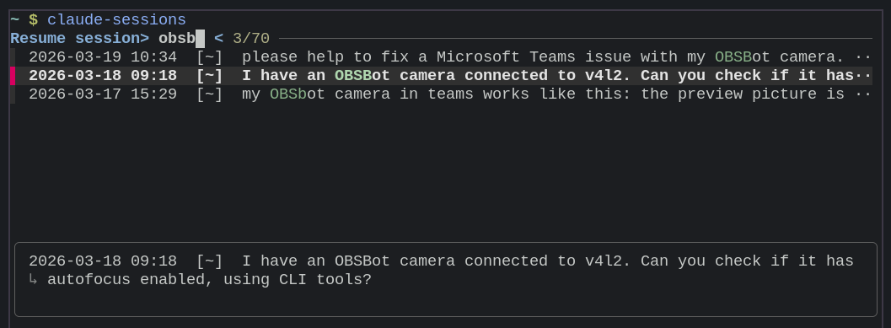

# claude-sessions

Browse and resume recent Claude Code sessions interactively.

Lists all sessions from `~/.claude/projects/` sorted by date (newest first), launches `fzf` for selection, then resumes the chosen session with `claude --resume <uuid>` in its original working directory.



## Requirements

- [`uv`](https://docs.astral.sh/uv/)
- [`fzf`](https://github.com/junegunn/fzf)
- [`claude`](https://claude.ai/code) CLI

## Install

```fish
uv tool install git+https://github.com/kjozsa/claude-sessions
```

## Usage

```fish
claude-sessions
```

## Local development

```fish
git clone https://github.com/kjozsa/claude-sessions
cd claude-sessions
uv run claude_sessions.py
```
